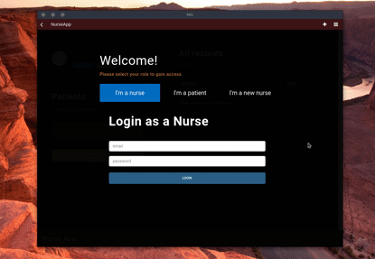
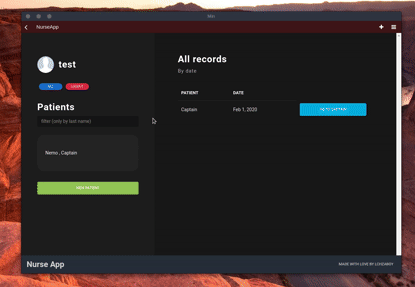
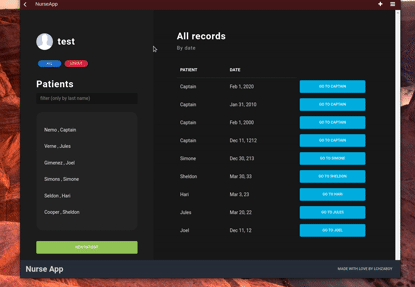
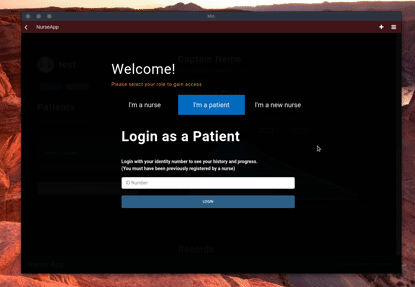

# NurseApp
MEAN app that lets nurses save their patients' records.

This is a little messy MEAN application I made to apply for a job.<br>
It is hosted in Heroku and it uses mLab for database.<br>
You can check it out at <a>https://nurseapplication.herokuapp.com/</a>

## With this app ..
  <h4> You can register as a nurse.</h4>
<p align="center"></p>
    <h4> You can save records for you patients.</h4>
   <p align="center"></p>
    <h4> You can search patients by name. </h4>
   <p align="center"></p>
   <h4> As a patient, you can check your data.</h4>
   <p align="center"></p>


## Installation
Install the dependencies in root, and then in angular-src with
 
```sh
$ npm install
```
Go back to root and run
 
```sh
$ npm start
```
